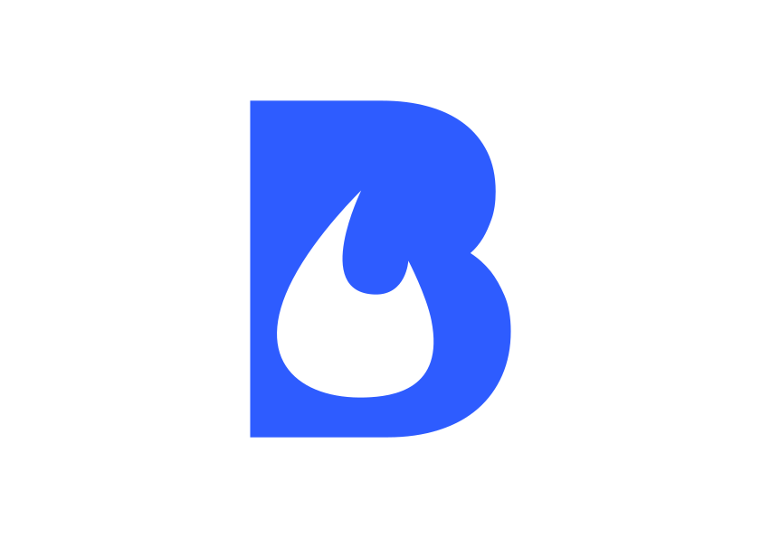

<p align="center">
  
  <h1 align="center">Blaze</h1>
  <p align="center"><a href="https://github.com/butaneprotocol/blaze" _target="blank">Blaze</a> is a library, which allows you to create Cardano transactions and off-chain code for your Aiken contracts in JavaScript.<br/><br/>
  Built with ❤️ by the Butane Team.
<p align="center">
    
    <a href="https://www.npmjs.com/package/@blaze-cardano/sdk">
      
    </a>
     <a href="https://blaze.butane.dev">
      
    </a>
    <a href="https://www.npmjs.com/package/@blaze-cardano/sdk">
      
    </a>
    
    <a href="https://twitter.com/butaneprotocol">
      
    </a>
    <a href="https://discord.gg/4hUAdHAexb">
      
    </a>
  </p>
</p>

### Get started

This api is experimental!

#### Installation

```
npm i @blaze-cardano/sdk
```

#### Basic Usage

```ts
//  In this example we:
//  - prepare the provider (Maestro), wallet, blaze,
//  - build a transaction paying out 5 ada to an external wallet
//  - dump the transaction cbor
import { ColdWallet, Core, Blaze, Maestro } from "@blaze-cardano/sdk";
import * as readline from "node:readline/promises";
import { stdin, stdout } from "node:process";
const rl = readline.createInterface({ input: stdin, output: stdout });

await setTimeout(() => {}, 1000);

let address = Core.addressFromBech32(
  await rl.question("Please enter your bech32 cardano address: "),
);

// $butane wallet can collect donations for us
const blazeWallet = Core.addressFromBech32(
  "addr1qye93uefq8r6ezk0kzq443u9zht7ylu5nelvw8eracd200ylzvhpxn9c4g2fyxe5rlmn6z5qmm3dtjqfjn2vvy58l88szlpjw4",
);

const provider = new Maestro({
  network: "mainnet",
  apiKey: await rl.question("Please enter your mainnet maestro key: "),
});
const wallet = new ColdWallet(address, 0, provider);

console.log("Your blaze address: ", wallet.address.toBech32());
const blaze = new Blaze(provider, wallet);

//Use the awesome transaction builder
const tx = await (await blaze.newTransaction())
  .payLovelace(blazeWallet, 5n * 1_000_000n)
  .complete();

// Dump the transaction for you to submit securely
console.log(`Please sign and submit this transaction: ${tx.toCbor()}`);
```

### Docs

Blaze channel is in the [TxPipe Discord](https://discord.gg/FAeAR6jX)!

### Contributing

Please see [contributing.md](./CONTRIBUTING.md)
